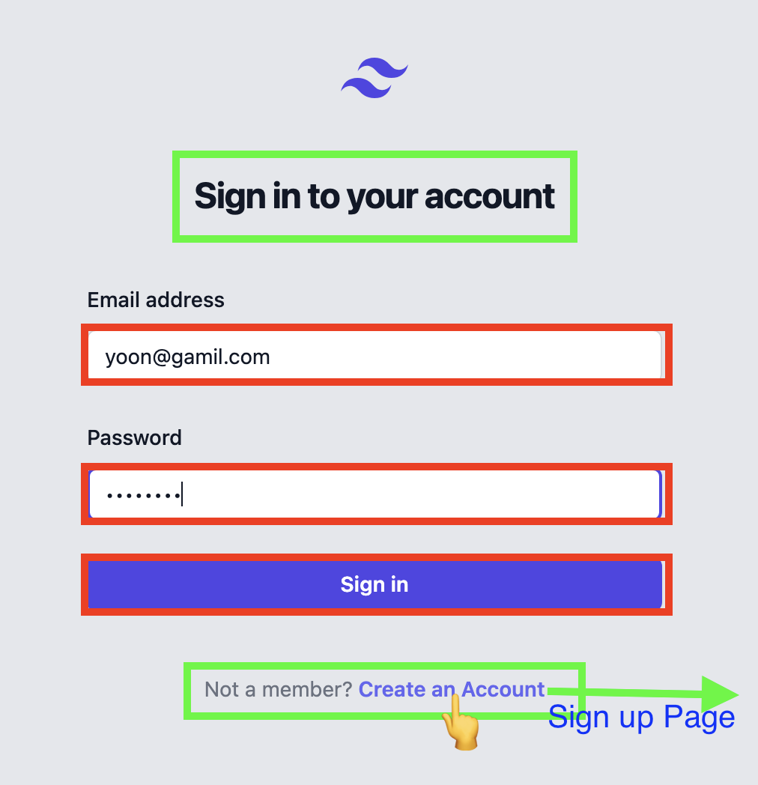
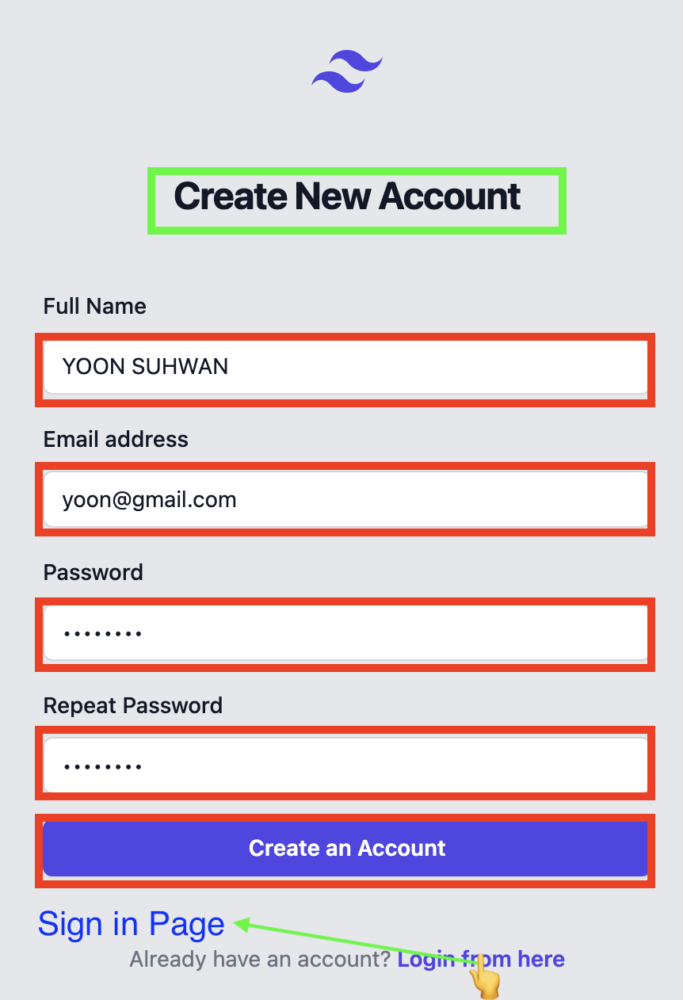
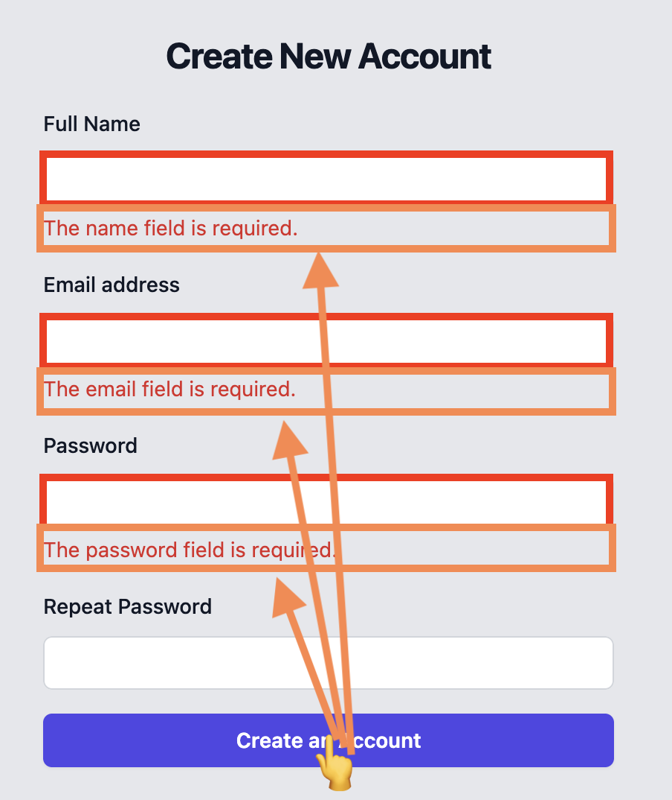
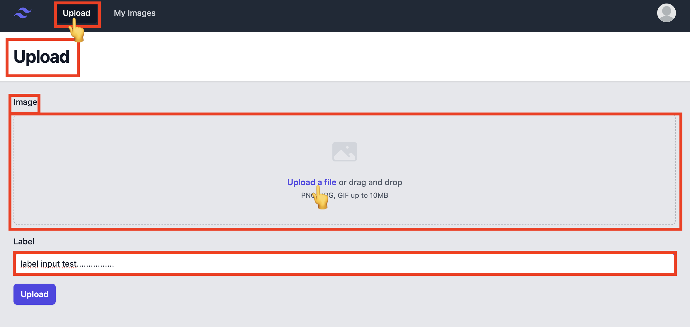
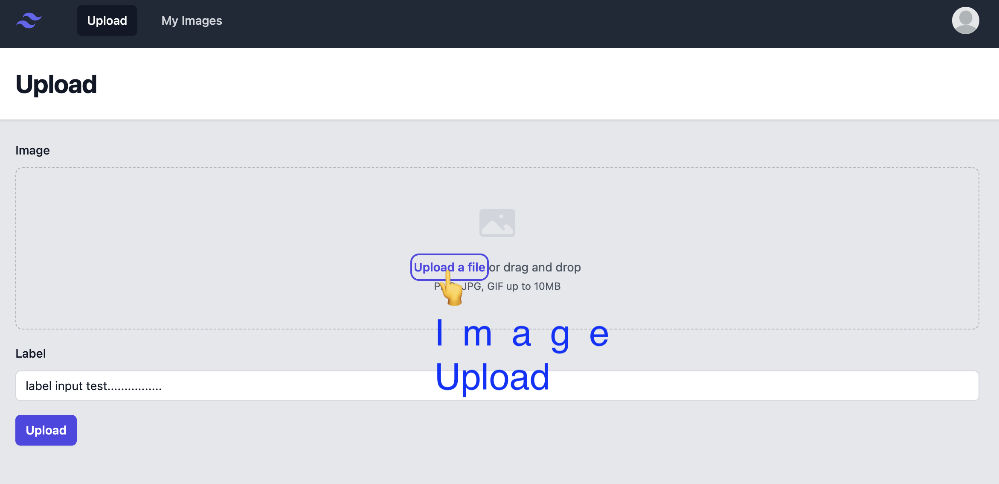
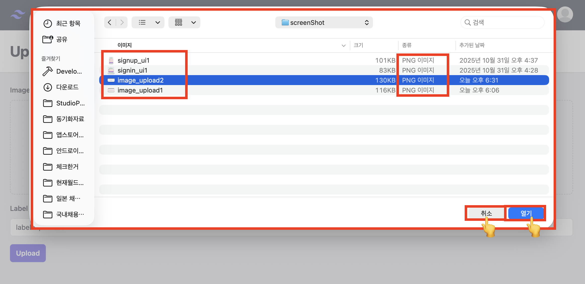
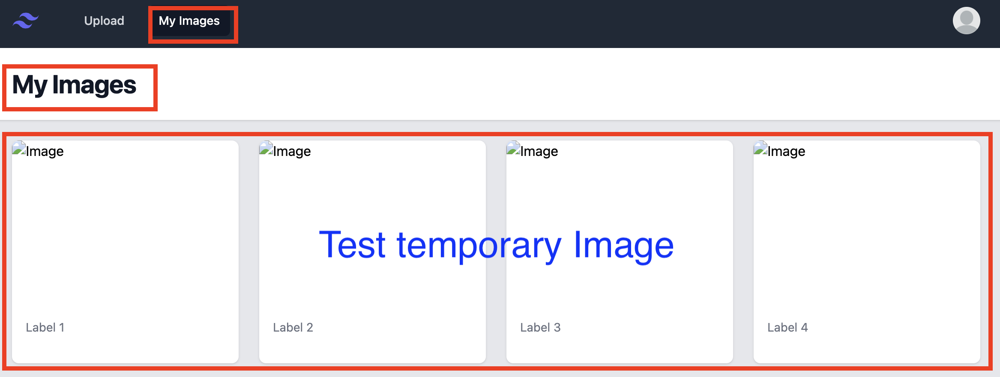
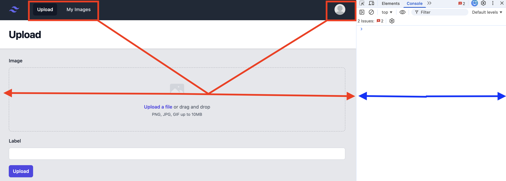
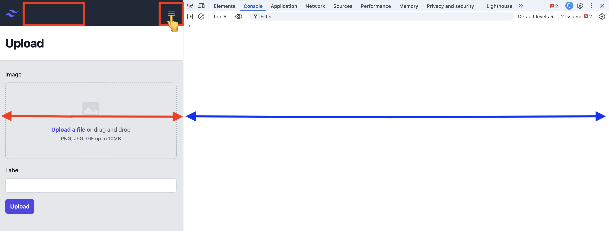
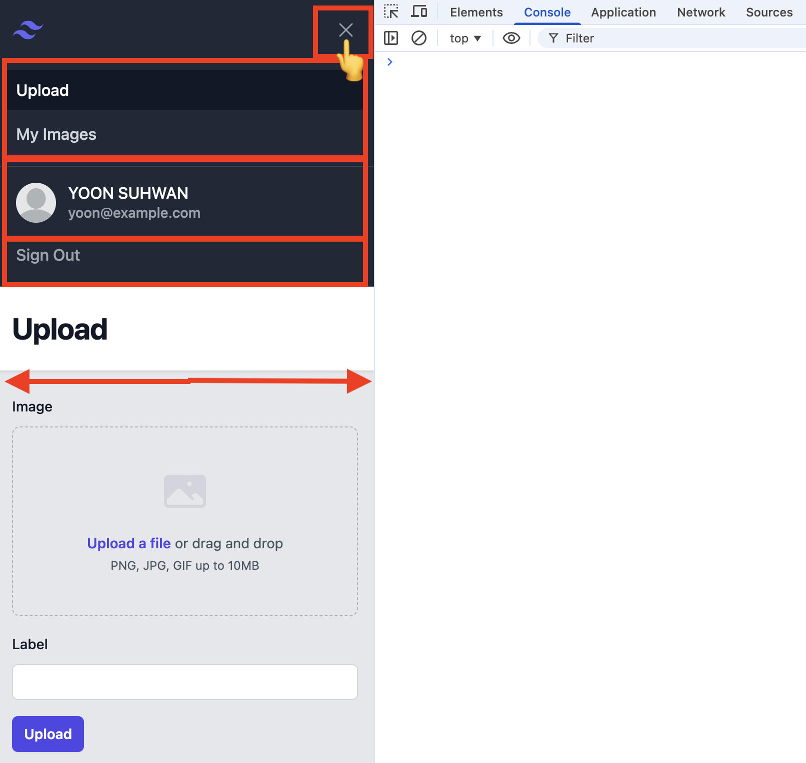

This project is a full-stack application built with a **Laravel API** backend and a **Vue.js** frontend.

*   **Backend:** **Laravel 12**. Configured for API usage.
*   **Frontend:** **Vue3.js (VJS)**.
*   **Language:** **PHP 8.4**

### Frontend (Vue.js) Stack & Libraries

The frontend application is configured with the following technologies:

| Technology | Role | Version/Description |
| :--- | :--- | :--- |
| **Vite** | Build Tool | `@latest` |
| **Vue Router** | Client-side Routing | Version 4 |
| **Pinia** | State Management | 3.0.3 |
| **Axios** | HTTP Client | Not specified |
| **Tailwind CSS** | CSS Framework | Version 3.4 |
| **PostCSS** | CSS Processing Tool | Not specified |
| **Autoprefixer** | CSS Vendor Prefixing | Not specified |
| **Headless UI/Vue**| UI Component Library | 1.7.23 |
| **Hero Icons/Vue**| Icon Library | 2.2.0 |
| **Node.js** | Used in GitHub Actions Runner | Version 22 (for frontend build) |

### Backend (Laravel) Stack & Tools

Technologies used for building the backend API and handling authentication:

| Technology | Role | Version/Description |
| :--- | :--- | :--- |
| **Laravel Breeze** | Starter Kit (API mode) | Not specified |
| **Laravel Sanctum** | Authentication Package | Used for session-based and token-based authentication |
| **Composer** | PHP Package Management | Version 2 |

### Application Screenshot
#### Signin Page
| | |
| :---: | :---: |
|  |  |

#### Signup Page
| | |
| :---: | :---: |
|  |  |

### Image Upload

### My Image

### Interactive Menu

